# Voice Scheduling Agent

A production-grade real-time voice scheduling agent built with Vapi, GPT-4o-mini, and Google Calendar.

---

## Architecture

```mermaid
graph TB
    subgraph User["User Layer"]
        U[User Browser]
        UV[User Voice]
    end
    subgraph Vapi["Vapi Cloud"]
        V[Voice Orchestration]
        LLM["GPT-4o-mini"]
        TOOL["Tool: create-event"]
        META["metadata: { sessionId, timezone }"]
    end
    subgraph Backend["Node.js Backend (Railway)"]
        MW["requestLogger - attach requestId"]
        RL[Rate limiter]
        AR["/auth/google/start + callback"]
        SR["/session/:sessionId - serve HTML + metadata"]
        CR["POST /api/create-event - Zod + luxon RFC3339"]
        GAS["googleAuth.ts - OAuth2 + token rotation"]
        CS["calendarService.ts - calendar.events.insert"]
        DB[("SQLite - sessionId to refreshToken")]
        LOG["Pino structured logs - redact tokens"]
    end
    subgraph Google["Google Cloud"]
        GAUTH[OAuth2]
        GCAL[Calendar API v3]
    end
    U -->|GET /auth/google/start| AR
    AR -->|redirect| GAUTH
    GAUTH -->|callback + code| AR
    AR -->|store refreshToken| DB
    AR -->|redirect| SR
    SR -->|HTML + sessionId injected| U
    U -->|vapi.start + metadata| META
    META --> V
    UV -->|speaks| V
    V --> LLM
    LLM --> TOOL
    TOOL -->|POST /api/create-event| MW
    MW --> RL --> CR
    CR --> GAS --> DB
    GAS --> CS
    CS -->|events.insert + IANA timezone| GCAL
    GCAL -->|eventId + htmlLink| CS
    CS --> CR
    CR -->|JSON| TOOL
```



---

## Stack

| Layer | Technology |
|---|---|
| Voice orchestration | Vapi |
| LLM | GPT-4o-mini |
| Backend | Node.js + TypeScript (strict) |
| Calendar | Google Calendar API v3 |
| Auth storage | SQLite (`better-sqlite3`) via Railway Volume |
| Logging | Pino (JSON in prod, pretty in dev) |
| Validation | Zod + Luxon (IANA timezone + RFC3339) |
| Rate limiting | `express-rate-limit` |

---

## Setup

### 1. Clone & install
```bash
git clone <repo>
cd voice-scheduling-agent
npm install
```

### 2. Environment variables
```bash
cp .env.example .env
# Edit .env with your real values
```

| Variable | Required | Description |
|---|---|---|
| `NODE_ENV` | No | `development` or `production` (default: `development`) |
| `PORT` | No | Server port (default: `3000`) |
| `LOG_LEVEL` | No | `debug`, `info`, `warn`, `error` (default: `info`) |
| `GOOGLE_CLIENT_ID` | **Yes** | Google OAuth2 client ID |
| `GOOGLE_CLIENT_SECRET` | **Yes** | Google OAuth2 client secret |
| `GOOGLE_REDIRECT_URI` | **Yes** | Full callback URL e.g. `https://your-app.railway.app/auth/google/callback` |
| `VAPI_ASSISTANT_ID` | **Yes** | Vapi assistant ID from dashboard |
| `DB_PATH` | No | SQLite file path (default: `./tokens.db`; Railway: `/data/tokens.db`) |

### 3. Google Cloud setup
1. Open [Google Cloud Console](https://console.cloud.google.com/apis/credentials)
2. Create a project → enable **Google Calendar API**
3. Create **OAuth 2.0 Client ID** (Web application)
4. Add authorised redirect URI: `https://your-app.railway.app/auth/google/callback`
5. Copy Client ID and Client Secret to `.env`

### 4. Run locally
```bash
npm run dev        # ts-node + nodemon (hot reload)
# or
npm run build && npm start   # compiled output
```

---

## Railway Deployment

### Deploy steps
1. Push code to GitHub
2. Create a new Railway project → connect GitHub repo
3. Add a **Volume** in Railway dashboard → mount path: `/data`
4. Set environment variables in Railway (all from `.env.example`)
5. Set `DB_PATH=/data/tokens.db` in Railway env vars
6. Set `GOOGLE_REDIRECT_URI=https://your-app.railway.app/auth/google/callback`
7. Deploy — Railway uses `Dockerfile` automatically

> **Important:** Railway Volumes are single-instance only. Do not scale this service horizontally without migrating to a networked database.

---

## API Reference

### `GET /health`
Liveness check. Verifies SQLite is accessible.

```json
{ "status": "ok", "timestamp": "2026-02-27T10:00:00.000Z", "db": "connected" }
```

### `GET /auth/google/start`
Initiates OAuth flow. Redirects browser to Google consent screen.

### `GET /auth/google/callback`
Google redirects here with `code` + `state=sessionId`. Exchanges code for tokens, stores refresh token, redirects to `/session/:sessionId`.

### `GET /session/:sessionId`
Returns an HTML page with the Vapi Web SDK. The browser's IANA timezone is detected and injected into Vapi call metadata automatically.

Returns `404` if sessionId not found in DB (with link to re-authenticate).

### `POST /api/create-event`
**Called by Vapi tool — not the browser directly.**

**Request body:**
```json
{
  "sessionId":    "uuid-v4",
  "name":         "John Smith",
  "date":         "2026-03-15",
  "time":         "14:30",
  "timezone":     "America/New_York",
  "durationMins": 30,
  "title":        "Project sync"
}
```

| Field | Type | Required | Notes |
|---|---|---|---|
| `sessionId` | UUID string | Yes | From OAuth session |
| `name` | string | Yes | Attendee name (max 100 chars) |
| `date` | string | Yes | `YYYY-MM-DD` — local date in given timezone |
| `time` | string | Yes | `HH:mm` 24h — local time in given timezone |
| `timezone` | string | Yes | IANA e.g. `"America/New_York"` |
| `durationMins` | integer | Yes | 5–240 minutes (default 30 if omitted from Vapi) |
| `title` | string | No | Defaults to `"Meeting with {name}"` |

**Success response (201):**
```json
{
  "ok":       true,
  "eventId":  "abc123xyz",
  "htmlLink": "https://www.google.com/calendar/event?eid=...",
  "summary":  "Project sync",
  "startISO": "2026-03-15T14:30:00-05:00",
  "endISO":   "2026-03-15T15:00:00-05:00",
  "timezone": "America/New_York"
}
```

**Error responses:**

| Status | Meaning |
|---|---|
| `400` | Validation failed (bad date format, past time, invalid timezone) |
| `401` | Session not found — user needs to re-authenticate |
| `403` | Insufficient Google Calendar permissions |
| `429` | Google API rate limit exceeded |
| `502` | Google Calendar API error |
| `500` | Internal server error |

---

## Integration Test (curl)

After completing OAuth at `http://localhost:3000/auth/google/start`, note the `sessionId` in the redirected URL, then:

```bash
curl -s -X POST http://localhost:3000/api/create-event \
  -H "Content-Type: application/json" \
  -d '{
    "sessionId":    "YOUR-SESSION-UUID",
    "name":         "Test User",
    "date":         "2026-03-20",
    "time":         "10:00",
    "timezone":     "America/New_York",
    "durationMins": 30,
    "title":        "Test Meeting"
  }' | jq .
```

**Expected success:**
```json
{
  "ok":       true,
  "eventId":  "abc123...",
  "htmlLink": "https://www.google.com/calendar/event?eid=...",
  "summary":  "Test Meeting",
  "startISO": "2026-03-20T10:00:00-04:00",
  "endISO":   "2026-03-20T10:30:00-04:00",
  "timezone": "America/New_York"
}
```

**Test validation rejection (past date):**
```bash
curl -s -X POST http://localhost:3000/api/create-event \
  -H "Content-Type: application/json" \
  -d '{
    "sessionId":    "YOUR-SESSION-UUID",
    "name":         "Test",
    "date":         "2020-01-01",
    "time":         "09:00",
    "timezone":     "UTC",
    "durationMins": 30
  }' | jq .
# Expected: 400 { "error": "The requested event time is in the past..." }
```

**Check debug logs (dev only):**
```bash
curl -s http://localhost:3000/debug/last-logs | jq '.entries[-5:]'
```

---

## Vapi Tool Schema

Add this tool to your Vapi assistant configuration:

```json
{
  "type": "function",
  "function": {
    "name": "create-event",
    "description": "Create a Google Calendar event for the user. Call only after confirming all details with the user.",
    "parameters": {
      "type": "object",
      "properties": {
        "sessionId": {
          "type": "string",
          "description": "Session ID from call metadata. Always use {{metadata.sessionId}}."
        },
        "name": {
          "type": "string",
          "description": "Full name of the person to schedule with."
        },
        "date": {
          "type": "string",
          "description": "Date in YYYY-MM-DD format (local date in the user's timezone)."
        },
        "time": {
          "type": "string",
          "description": "Time in HH:mm 24-hour format (local time in the user's timezone)."
        },
        "timezone": {
          "type": "string",
          "description": "IANA timezone identifier e.g. America/New_York. Use {{metadata.timezone}} by default, but ask the user if they want a different timezone."
        },
        "durationMins": {
          "type": "number",
          "description": "Meeting duration in minutes (5–240). Default 30 if not specified."
        },
        "title": {
          "type": "string",
          "description": "Optional meeting title. Omit to use default 'Meeting with {name}'."
        }
      },
      "required": ["sessionId", "name", "date", "time", "timezone", "durationMins"]
    }
  }
}
```

**Vapi System Prompt (key instructions):**
```
You are a scheduling assistant. When a user wants to schedule a meeting:
1. Collect their name
2. Ask for the date and time they prefer
3. Default to the timezone in {{metadata.timezone}} — only ask if they mention a different city/timezone
4. Ask for a meeting title (optional — let them skip it)
5. Ask for duration (default 30 minutes if not specified)
6. Confirm all details before calling the tool
7. If the tool returns an error, explain it naturally and offer to retry
```

---

## Logging

All logs are structured JSON in production. Example log lines:

```json
{"level":30,"time":1709000000000,"requestId":"uuid","method":"POST","path":"/api/create-event","ip":"::1","msg":"Request received"}
{"level":30,"time":1709000000001,"requestId":"uuid","sessionIdHash":"abc123def456","event":"calendar.create.attempt","startISO":"2026-03-20T10:00:00-04:00","timezone":"America/New_York","msg":"calendar.create.attempt"}
{"level":30,"time":1709000000250,"requestId":"uuid","event":"calendar.create.success","eventId":"xyz789","htmlLink":"https://...","msg":"calendar.create.success"}
```

Token values never appear in logs. Sensitive fields are redacted by pino: `access_token`, `refresh_token`, `client_secret`, `code`, `req.headers.authorization`.

---

## Troubleshooting

| Problem | Cause | Fix |
|---|---|---|
| `"Google did not return a refresh_token"` | User previously granted access without `prompt=consent` | Revoke app access at [myaccount.google.com/permissions](https://myaccount.google.com/permissions), then re-auth |
| `401 "Google authorisation expired"` | Refresh token revoked | User must re-visit `/auth/google/start` |
| `403 "Insufficient permissions"` | Calendar API not enabled or wrong scope | Enable Google Calendar API in Cloud Console; check scope is `calendar.events` |
| Session page shows 404 | OAuth never completed, or DB was reset | Re-visit `/auth/google/start` |
| SQLite errors on Railway | Volume not attached | Create volume in Railway dashboard, mount at `/data`, set `DB_PATH=/data/tokens.db` |
| Rate limit hit on `/auth` | Too many OAuth attempts | Wait 15 minutes |
| `durationMins` clamped unexpectedly | Value outside 5–240 range | Ensure Vapi passes a value between 5 and 240 |
