# Voice Scheduling Agent

A production-grade real-time voice scheduling agent built with Vapi, GPT-4o-mini, and Google Calendar.

---

## 🚀 Deployed URL

**Live:** https://voice-scheduling-agent.up.railway.app

---

## 🧪 How to Test the Agent

### Option 1 — Use the live deployment (recommended)

1. Open **https://voice-scheduling-agent.up.railway.app**
2. Click **"Start Voice Scheduling"** on the landing page
3. Complete the Google OAuth consent screen (grant Calendar access)
4. You will be redirected to the voice call page automatically
5. Click **"🎙 Start Voice Call"**
6. Speak naturally — example conversation:
   > *"Hi, my name is Alex. I'd like to schedule a meeting tomorrow at 3 PM for 30 minutes. The title is Project Review."*
7. The assistant will confirm the details and create the event
8. After the call ends, a **meeting card** appears in the right panel with a direct link to the Google Calendar event
9. Check your Google Calendar — the event will be there

### Option 2 — Run locally

```bash
git clone https://github.com/yakupzengin/voice-scheduling-agent
cd voice-scheduling-agent
npm install
cp .env.example .env
# Fill in .env with your own Google OAuth + Vapi credentials
npm run dev
# Open http://localhost:3000
```

---

## 📸 Screenshots & Demo

### Railway Deployment — Live Production


### Demo Video — Full Flow (OAuth → Voice Call → Event Created)

▶️ **[Watch on YouTube](https://youtu.be/hvvtOpy2wkU)**

The video shows the complete flow: Google OAuth authentication, voice conversation with the assistant, Google Calendar event creation, and the meeting card appearing in the UI.


---

## Architecture


---

## Stack

| Layer | Technology |
|---|---|
| Voice orchestration | Vapi |
| LLM | GPT-4o-mini |
| Backend | Node.js + TypeScript (strict) |
| Calendar | Google Calendar API v3 |
| Auth storage | SQLite (`better-sqlite3`) via Railway Volume |
| Logging | Pino (JSON in prod, pretty in dev) |
| Validation | Zod + Luxon (IANA timezone + RFC3339) |
| Rate limiting | `express-rate-limit` |

---

## Setup

### 1. Clone & install
```bash
git clone <repo>
cd voice-scheduling-agent
npm install
```

### 2. Environment variables
```bash
cp .env.example .env
# Edit .env with your real values
```

| Variable | Required | Description |
|---|---|---|
| `NODE_ENV` | No | `development` or `production` (default: `development`) |
| `PORT` | No | Server port (default: `3000`) |
| `LOG_LEVEL` | No | `debug`, `info`, `warn`, `error` (default: `info`) |
| `GOOGLE_CLIENT_ID` | **Yes** | Google OAuth2 client ID |
| `GOOGLE_CLIENT_SECRET` | **Yes** | Google OAuth2 client secret |
| `GOOGLE_REDIRECT_URI` | **Yes** | Full callback URL e.g. `https://your-app.railway.app/auth/google/callback` |
| `VAPI_ASSISTANT_ID` | **Yes** | Vapi assistant ID from dashboard |
| `DB_PATH` | No | SQLite file path (default: `./tokens.db`; Railway: `/data/tokens.db`) |

### 3. Google Cloud setup
1. Open [Google Cloud Console](https://console.cloud.google.com/apis/credentials)
2. Create a project → enable **Google Calendar API**
3. Create **OAuth 2.0 Client ID** (Web application)
4. Add authorised redirect URI: `https://your-app.railway.app/auth/google/callback`
5. Copy Client ID and Client Secret to `.env`

### 4. Run locally
```bash
npm run dev        # ts-node + nodemon (hot reload)
# or
npm run build && npm start   # compiled output
```

---

## Railway Deployment

### Deploy steps
1. Push code to GitHub
2. Create a new Railway project → connect GitHub repo
3. Add a **Volume** in Railway dashboard → mount path: `/data`
4. Set environment variables in Railway (all from `.env.example`)
5. Set `DB_PATH=/data/tokens.db` in Railway env vars
6. Set `GOOGLE_REDIRECT_URI=https://your-app.railway.app/auth/google/callback`
7. Deploy — Railway uses `Dockerfile` automatically

> **Important:** Railway Volumes are single-instance only. Do not scale this service horizontally without migrating to a networked database.

---

## API Reference

### `GET /health`
Liveness check. Verifies SQLite is accessible.

```json
{ "status": "ok", "timestamp": "2026-02-27T10:00:00.000Z", "db": "connected" }
```

### `GET /auth/google/start`
Initiates OAuth flow. Redirects browser to Google consent screen.

### `GET /auth/google/callback`
Google redirects here with `code` + `state=sessionId`. Exchanges code for tokens, stores refresh token, redirects to `/session/:sessionId`.

### `GET /session/:sessionId`
Returns an HTML page with the Vapi Web SDK. The browser's IANA timezone is detected and injected into Vapi call metadata automatically.

Returns `404` if sessionId not found in DB (with link to re-authenticate).

### `POST /api/create-event`
**Called by Vapi tool — not the browser directly.**

**Request body:**
```json
{
  "sessionId":    "uuid-v4",
  "name":         "John Smith",
  "date":         "March 15, 2026",
  "time":         "3 PM",
  "timezone":     "America/New_York",
  "durationMins": 30,
  "title":        "Project sync"
}
```

| Field | Type | Required | Notes |
|---|---|---|---|
| `sessionId` | UUID string | Yes | From OAuth session |
| `name` | string | Yes | Attendee name (max 100 chars) |
| `date` | string | Yes | Any human-readable date — e.g. `"2026-03-15"`, `"15/03/2026"`, `"March 15, 2026"` |
| `time` | string | Yes | Any human-readable time — e.g. `"14:30"`, `"2:30 PM"`, `"3 PM"` |
| `timezone` | string | Yes | IANA e.g. `"America/New_York"` |
| `durationMins` | integer | Yes | 5–240 minutes (default 30 if omitted from Vapi) |
| `title` | string | No | Defaults to `"Meeting with {name}"` |

**Success response (201):**
```json
{
  "ok":       true,
  "eventId":  "abc123xyz",
  "htmlLink": "https://www.google.com/calendar/event?eid=...",
  "summary":  "Project sync",
  "startISO": "2026-03-15T14:30:00-05:00",
  "endISO":   "2026-03-15T15:00:00-05:00",
  "timezone": "America/New_York"
}
```

**Error responses:**

| Status | Meaning |
|---|---|
| `400` | Validation failed (bad date format, past time, invalid timezone) |
| `401` | Session not found — user needs to re-authenticate |
| `403` | Insufficient Google Calendar permissions |
| `429` | Google API rate limit exceeded |
| `502` | Google Calendar API error |
| `500` | Internal server error |

---

## Integration Test (curl)

After completing OAuth at `http://localhost:3000/auth/google/start`, note the `sessionId` in the redirected URL, then:

```bash
curl -s -X POST http://localhost:3000/api/create-event \
  -H "Content-Type: application/json" \
  -d '{
    "sessionId":    "YOUR-SESSION-UUID",
    "name":         "Test User",
    "date":         "2026-03-20",
    "time":         "10:00",
    "timezone":     "America/New_York",
    "durationMins": 30,
    "title":        "Test Meeting"
  }' | jq .
```

**Expected success:**
```json
{
  "ok":       true,
  "eventId":  "abc123...",
  "htmlLink": "https://www.google.com/calendar/event?eid=...",
  "summary":  "Test Meeting",
  "startISO": "2026-03-20T10:00:00-04:00",
  "endISO":   "2026-03-20T10:30:00-04:00",
  "timezone": "America/New_York"
}
```

**Test validation rejection (past date):**
```bash
curl -s -X POST http://localhost:3000/api/create-event \
  -H "Content-Type: application/json" \
  -d '{
    "sessionId":    "YOUR-SESSION-UUID",
    "name":         "Test",
    "date":         "2020-01-01",
    "time":         "09:00",
    "timezone":     "UTC",
    "durationMins": 30
  }' | jq .
# Expected: 400 { "error": "The requested event time is in the past..." }
```

**Check debug logs (dev only):**
```bash
curl -s http://localhost:3000/debug/last-logs | jq '.entries[-5:]'
```

---

## Vapi Tool Schema

Add this tool to your Vapi assistant configuration:

```json
{
  "type": "function",
  "function": {
    "name": "create-event",
    "description": "Create a Google Calendar event for the user. Call only after confirming all details with the user.",
    "parameters": {
      "type": "object",
      "properties": {
        "sessionId": {
          "type": "string",
          "description": "Session ID from call metadata. Always use {{metadata.sessionId}}."
        },
        "name": {
          "type": "string",
          "description": "Full name of the person to schedule with."
        },
        "date": {
          "type": "string",
          "description": "Date in YYYY-MM-DD format (local date in the user's timezone)."
        },
        "time": {
          "type": "string",
          "description": "Time in HH:mm 24-hour format (local time in the user's timezone)."
        },
        "timezone": {
          "type": "string",
          "description": "IANA timezone identifier e.g. America/New_York. Use {{metadata.timezone}} by default, but ask the user if they want a different timezone."
        },
        "durationMins": {
          "type": "number",
          "description": "Meeting duration in minutes (5–240). Default 30 if not specified."
        },
        "title": {
          "type": "string",
          "description": "Optional meeting title. Omit to use default 'Meeting with {name}'."
        }
      },
      "required": ["sessionId", "name", "date", "time", "timezone", "durationMins"]
    }
  }
}
```

**Vapi System Prompt (key instructions):**
```
You are a scheduling assistant. When a user wants to schedule a meeting:
1. Collect their name
2. Ask for the date and time they prefer
3. Default to the timezone in {{metadata.timezone}} — only ask if they mention a different city/timezone
4. Ask for a meeting title (optional — let them skip it)
5. Ask for duration (default 30 minutes if not specified)
6. Confirm all details before calling the tool
7. If the tool returns an error, explain it naturally and offer to retry
```

---

## Logging

All logs are structured JSON in production. Example log lines:

```json
{"level":30,"time":1709000000000,"requestId":"uuid","method":"POST","path":"/api/create-event","ip":"::1","msg":"Request received"}
{"level":30,"time":1709000000001,"requestId":"uuid","sessionIdHash":"abc123def456","event":"calendar.create.attempt","startISO":"2026-03-20T10:00:00-04:00","timezone":"America/New_York","msg":"calendar.create.attempt"}
{"level":30,"time":1709000000250,"requestId":"uuid","event":"calendar.create.success","eventId":"xyz789","htmlLink":"https://...","msg":"calendar.create.success"}
```

Token values never appear in logs. Sensitive fields are redacted by pino: `access_token`, `refresh_token`, `client_secret`, `code`, `req.headers.authorization`.

---

## Calendar Integration — Deep Dive

This section explains the complete lifecycle of a calendar event — from the moment the user speaks to the moment the event appears in Google Calendar. Every design decision is explained with its rationale.

---

### 1. High-Level Flow

```mermaid
sequenceDiagram
    autonumber
    actor User
    participant Browser
    participant Vapi
    participant LLM as GPT-4o-mini
    participant Backend as Node.js Backend
    participant Google as Google Calendar API

    User->>Browser: Click "Start Voice Call"
    Browser->>Vapi: vapi.start(assistantId, { metadata: { sessionId, timezone } })
    Vapi->>LLM: System prompt + metadata context
    User->>Vapi: 🎙 "I want to schedule a meeting tomorrow at 3 PM"
    Vapi->>LLM: Transcribed speech
    LLM->>Vapi: Confirm details with user
    Vapi->>User: 🤖 "Got it — any title for this meeting?"
    User->>Vapi: 🎙 "Project sync"
    LLM->>Vapi: Call tool create-event
    Vapi->>Backend: POST /api/create-event (tool call envelope)
    Backend->>Backend: Unwrap Vapi envelope, Zod validation
    Backend->>Backend: chrono-node NLP parsing (timezone-aware)
    Backend->>Backend: Past-time guard (luxon)
    Backend->>Google: calendar.events.insert (RFC3339 + IANA zone)
    Google-->>Backend: { eventId, htmlLink }
    Backend-->>Vapi: { results: [{ toolCallId, result: "Successfully created..." }] }
    Vapi->>LLM: Tool result
    LLM->>Vapi: Confirmation message
    Vapi->>User: 🤖 "Your meeting has been scheduled!"
    Browser->>Backend: GET /api/session-events/:sessionId (on call-end)
    Backend-->>Browser: { events: [{ title, startISO, timezone, htmlLink }] }
    Browser->>User: 📅 Meeting card rendered in UI
```



---

### 2. OAuth 2.0 Authentication Flow

The agent uses Google OAuth 2.0 with **offline access** (refresh token) so events can be created server-side without requiring the user to be actively logged in each time.


**Key security decisions:**

| Decision | Rationale |
|---|---|
| `prompt=consent` on every auth | Forces Google to always issue a `refresh_token`. Without it, returning users get no refresh token and cannot schedule events server-side. |
| Store only `refresh_token` | Access tokens expire in 1 hour and are useless to store. refresh tokens are long-lived and let us call the API on demand. |
| `state=sessionId` round-trip | Eliminates the need for server-side session storage before the callback. The UUID is self-contained in the OAuth state parameter. |
| `scope=calendar.events` only | Principle of least privilege — we never request read access to existing events, contacts, or any other Google data. |
| Token rotation listener | `client.on('tokens', ...)` — if Google issues a new `refresh_token` (rare but possible), it is immediately persisted to SQLite. |

---

### 3. Date & Time Parsing Pipeline

Natural language date/time parsing is one of the hardest problems in scheduling. The pipeline went through several iterations before arriving at the current approach.

#### 3.1 Why not let the LLM format dates?

> GPT-4o-mini anchors relative expressions like "tomorrow" and "next week" to its **training data cutoff date** — not the current runtime date. This caused events to be created in 2023 instead of 2026.

The solution: the LLM collects the user's **raw intent** ("tomorrow at 3 PM") and passes it verbatim to the backend. The backend resolves it against the real server clock.

#### 3.2 The Timezone Problem

`chrono-node` is a Node.js library with no timezone awareness — it always interprets times relative to the **process's local clock** (UTC on Railway). This caused an 11 PM request to create a 2 AM event for users in UTC+3 timezones.

```mermaid
flowchart LR
    A["User says '11 PM'\nin Istanbul UTC+3"] --> B["LLM sends\ndate='tomorrow'\ntime='11 PM'\ntimezone='Europe/Istanbul'"]
    B --> C["Backend receives args"]

    subgraph old["❌ Old approach (broken)"]
        C --> D["chrono.parseDate('tomorrow 11 PM')"]
        D --> E["Parsed as 2026-03-03T23:00:00 UTC"]
        E --> F["setZone('Europe/Istanbul')"]
        F --> G["2026-03-04T02:00:00+03:00\n(3 hours off!)"]
    end

    subgraph new["✅ New approach (correct)"]
        C --> H["Compute now in Istanbul:\n2026-03-02T01:24:00+03:00"]
        H --> I["Build fake reference Date\nwith LOCAL components as UTC:\nnew Date(2026, 2, 2, 1, 24, 0)"]
        I --> J["chrono.parseDate('tomorrow 11 PM', ref)"]
        J --> K["Parsed as 2026-03-03T23:00:00\n(UTC fields = Istanbul wall clock)"]
        K --> L["setZone('Europe/Istanbul',\n{ keepLocalTime: true })"]
        L --> M["2026-03-03T23:00:00+03:00 ✓"]
    end
```



#### 3.3 Full Parsing Pipeline (Code)

```typescript
// Step 1: Get current time in the user's timezone
const nowInUserTz = DateTime.now().setZone(timezone);

// Step 2: Build a "fake" JS Date whose UTC fields hold the user's
//         local time components — this tricks chrono into using their clock
const tzAwareRef = new Date(
  nowInUserTz.year,
  nowInUserTz.month - 1,  // JS months are 0-based
  nowInUserTz.day,
  nowInUserTz.hour,
  nowInUserTz.minute,
  nowInUserTz.second,
);

// Step 3: chrono-node NLP parse — supports "tomorrow", "3 PM", "next Friday", etc.
const combined  = `${date} ${time}`;          // e.g. "tomorrow 11 PM"
const parsedDate = chrono.parseDate(combined, tzAwareRef, { forwardDate: true });

// Step 4: keepLocalTime: true — reinterpret UTC fields as local wall-clock time
//         and apply the real timezone offset
const startDt = DateTime.fromJSDate(parsedDate)
  .setZone(timezone, { keepLocalTime: true }); // → 2026-03-03T23:00:00+03:00 ✓
```

#### 3.4 Accepted Date/Time Formats

The backend accepts any human-readable input that `chrono-node` can understand:

| User says | Parsed as (Istanbul, UTC+3) |
|---|---|
| `"today"`, `"3 PM"` | `2026-03-02T15:00:00+03:00` |
| `"tomorrow"`, `"11 PM"` | `2026-03-03T23:00:00+03:00` |
| `"next Monday"`, `"2:30pm"` | Next Monday at 14:30 local |
| `"March 15"`, `"14:00"` | `2026-03-15T14:00:00+03:00` |
| `"5th April"`, `"noon"` | `2026-04-05T12:00:00+03:00` |
| `"2026-03-20"`, `"10:00"` | `2026-03-20T10:00:00+03:00` |

---

### 4. Request Validation Pipeline

Every tool call from Vapi passes through a multi-stage validation pipeline before touching the Google API.


---

### 5. Vapi Tool Call Protocol

Vapi does not call the backend with a plain JSON body. It wraps the call in an **envelope format** that must be unwrapped before validation.

#### 5.1 Incoming Vapi Envelope

```json
{
  "message": {
    "type": "tool-calls",
    "toolCallList": [
      {
        "id": "call_abc123",
        "function": {
          "name": "create-event",
          "arguments": {
            "name":         "Jacob",
            "date":         "tomorrow",
            "time":         "11 PM",
            "durationMins": 30,
            "title":        "Big Project"
          }
        }
      }
    ],
    "call": {
      "metadata": {
        "sessionId": "uuid-v4-from-oauth",
        "timezone":  "Europe/Istanbul"
      }
    }
  }
}
```

#### 5.2 Required Response Format

Vapi requires `HTTP 200` with this exact shape. Any other status code causes the LLM to receive "No result returned":

```json
{
  "results": [
    {
      "toolCallId": "call_abc123",
      "result":     "Successfully created \"Big Project\" on 2026-03-03T23:00:00 (Europe/Istanbul)."
    }
  ]
}
```

#### 5.3 Metadata Injection

Context is passed from the browser session to Vapi to the tool call automatically:


> **Note:** Vapi does NOT substitute `{{metadata.key}}` from `variableValues` — dotted keys are silently ignored. Use plain keys (`{{sessionId}}`, `{{timezone}}`) and pass them as top-level `variableValues` entries.

---

### 6. Google Calendar API Integration

#### 6.1 Event Payload

The Google Calendar API receives a fully-qualified RFC 3339 datetime with an explicit IANA timezone. Google handles all DST transitions correctly:

```json
{
  "summary":     "Big Project",
  "description": "Scheduled for Jacob",
  "start": {
    "dateTime": "2026-03-03T23:00:00",
    "timeZone": "Europe/Istanbul"
  },
  "end": {
    "dateTime": "2026-03-03T23:30:00",
    "timeZone": "Europe/Istanbul"
  }
}
```

#### 6.2 Token Lifecycle


#### 6.3 Error Mapping

Raw Google API errors are mapped to meaningful HTTP status codes and user-friendly messages:

| Google Error | Mapped Status | Message to LLM |
|---|---|---|
| `invalid_grant` | `401` | "Google authorisation expired. Please reconnect…" |
| `insufficientPermissions` | `403` | "Insufficient calendar permissions. Please reconnect…" |
| `quotaExceeded` / `rateLimitExceeded` | `429` | "Rate limit exceeded. Please try again shortly." |
| Any other Google error | `502` | "Google Calendar API error: {original message}" |
| Unknown server error | `500` | "Internal server error. Please try again." |

---

### 7. Audit Logging

Every scheduling attempt — successful or not — is written to `logs/calendar-audit.jsonl` as an append-only newline-delimited JSON file. This provides a complete audit trail for debugging and compliance.

#### 7.1 Audit Entry Lifecycle


#### 7.2 Sample Audit Entries

**Successful event creation:**
```json
{
  "timestamp":      "2026-03-02T10:15:32.000Z",
  "requestId":      "f1a2b3c4-...",
  "sessionIdHash":  "a1b2c3d4e5f6",
  "stage":          "google_success",
  "input": {
    "date":         "tomorrow",
    "time":         "11 PM",
    "timezone":     "Europe/Istanbul",
    "durationMins": 30,
    "name":         "Jacob",
    "title":        "Big Project"
  },
  "parsedStartISO": "2026-03-03T23:00:00",
  "parsedEndISO":   "2026-03-03T23:30:00",
  "timezone":       "Europe/Istanbul",
  "googlePayload": {
    "summary": "Big Project",
    "start":   { "dateTime": "2026-03-03T23:00:00", "timeZone": "Europe/Istanbul" },
    "end":     { "dateTime": "2026-03-03T23:30:00", "timeZone": "Europe/Istanbul" }
  },
  "eventId":  "abc123xyz",
  "htmlLink": "https://www.google.com/calendar/event?eid=..."
}
```

**Validation failure:**
```json
{
  "timestamp":     "2026-03-02T10:12:00.000Z",
  "requestId":     "d4e5f6a7-...",
  "sessionIdHash": "--",
  "stage":         "validation_error",
  "errorMessage":  "sessionId: sessionId must be a valid UUID"
}
```

> **Security:** `sessionIdHash` is a truncated SHA-256 of the raw UUID — never the raw UUID itself. Access tokens, refresh tokens, and client secrets are redacted by pino before any log line is written.

---

### 8. Session Event Store (UI ↔ Backend Bridge)

After a call ends, the browser needs to display what meetings were created. Since we can't reliably intercept Vapi's internal tool result messages on the client, the backend maintains a per-session in-memory event store.

```mermaid
flowchart TD
    A["Google Calendar API\nreturns { eventId, htmlLink }"] --> B["storeSessionEvent(sessionId, {\n  title, startISO, timezone, htmlLink\n})"]
    B --> C["sessionEventStore Map\nsessionId → SessionEvent[]"]
    D["vapi call-end event\nin browser"] --> E["fetch('/api/session-events/:sessionId')"]
    E --> F["GET /api/session-events/:sessionId\nRoute handler"]
    F --> C
    C --> F
    F --> E
    E --> G["Render meeting cards\nwith real Google Calendar links"]
```



**Why in-memory rather than SQLite?**
The event store is intentionally ephemeral — it only needs to survive a single browser session. Using SQLite would add write overhead and schema complexity for data that has zero long-term value. If the server restarts mid-call, the UI simply shows no cards (the event still exists in Google Calendar).

---

## Troubleshooting

| Problem | Cause | Fix |
|---|---|---|
| `"Google did not return a refresh_token"` | User previously granted access without `prompt=consent` | Revoke app access at [myaccount.google.com/permissions](https://myaccount.google.com/permissions), then re-auth |
| `401 "Google authorisation expired"` | Refresh token revoked | User must re-visit `/auth/google/start` |
| `403 "Insufficient permissions"` | Calendar API not enabled or wrong scope | Enable Google Calendar API in Cloud Console; check scope is `calendar.events` |
| Session page shows 404 | OAuth never completed, or DB was reset | Re-visit `/auth/google/start` |
| SQLite errors on Railway | Volume not attached | Create volume in Railway dashboard, mount at `/data`, set `DB_PATH=/data/tokens.db` |
| Rate limit hit on `/auth` | Too many OAuth attempts | Wait 15 minutes |
| `durationMins` clamped unexpectedly | Value outside 5–240 range | Ensure Vapi passes a value between 5 and 240 |
| Meeting card not appearing | Call ended too quickly before fetch | Re-open the session URL and check Google Calendar directly |
